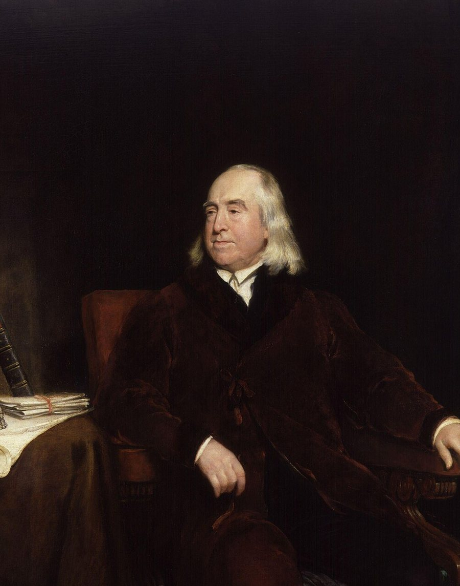

# ⚖️ Utilitarianism — The Greatest Happiness for the Greatest Number

A live, interactive presentation on **Utilitarianism** — the moral doctrine that an action is right insofar as it promotes the *greatest happiness for the greatest number*, and the business world's fascination with it.

---

## 🌐 View the Site

👉 **[Open the live presentation](https://vnsannn.github.io/utilitarianism/)**

Scroll through six sections: About, Origins (timeline), Nature, Critiques, Business Fascination, and Conclusion.

> Best viewed on a desktop browser. Fully responsive on mobile, but the custom cursor and some interactions are desktop-only.

---

### 👥 Presented by

**TEAM 4**
CALDERON, VIEN FRITZGERALD V. · CAMACHO, PRINCESS NINA Q. · CAPANANG, ICE WYETH · DELIVA, FRANZEUS ANDREI B. · ORENA, CHRISTIAN M. · VILLACORTA, SHAINNAH G.
BSIT — Dalubhasaang Politekniko ng Lungsod ng Baliwag

---

## 📜 License

This repository is available for **public viewing only**. See [LICENSE.md](LICENSE.md).

---

## 📬 Contact

**Vien Fritzgerald V. Calderon**
📧 viencalderon15@gmail.com
🔗 [github.com/vnsannn](https://github.com/vnsannn)
